## How This Tutorial Works

You start with an empty HTML file and build up to a polished, responsive restaurant menu. Each stage introduces **one concept** and always leaves you with a working page you can open in your browser.

No frameworks. No build tools. Just HTML, CSS, and a browser.

## The Pipeline

```mermaid
graph LR
    A[HTML Skeleton] --> B[Header & Intro]
    B --> C[Semantic Sections]
    C --> D[Menu Items]
    D --> E[Footer]
    E --> F[Basic CSS]
    F --> G[Spacing]
    G --> H[Menu Cards]
    H --> I[Flexbox Layout]
    I --> J[Polish & Responsive]

    style A fill:#92400e,color:#fff
    style B fill:#92400e,color:#fff
    style C fill:#92400e,color:#fff
    style D fill:#b45309,color:#fff
    style E fill:#b45309,color:#fff
    style F fill:#d97706,color:#fff
    style G fill:#d97706,color:#fff
    style H fill:#d97706,color:#fff
    style I fill:#f59e0b,color:#000
    style J fill:#f59e0b,color:#000
```

## Stages

### 🏗️ Foundation

| Stage | Concept | Status |
|-------|---------|--------|
| [0 -- HTML Skeleton](/stage-00/) | Basic HTML document structure | Available |
| 1 — Header & Intro | Headings and paragraphs | -- |
| 2 — Semantic Sections | Semantic HTML elements | -- |

### 🍔 Content

| Stage | Concept | Status |
|-------|---------|--------|
| 3 — Menu Items | Reusable HTML patterns | -- |
| 4 — Footer | Page completion with footer | -- |

### 🎨 Styling

| Stage | Concept | Status |
|-------|---------|--------|
| 5 — Basic CSS | CSS fundamentals | -- |
| 6 — Spacing | The CSS box model | -- |
| 7 — Menu Cards | Visual components with CSS | -- |

### 📐 Layout & Polish

| Stage | Concept | Status |
|-------|---------|--------|
| 8 — Flexbox Layout | Flexbox basics | -- |
| 9 — Polish & Responsive | Pseudo-classes and responsive design | -- |

## Tech Stack

| Technology | Version |
|-----------|---------|
| HTML | 5 |
| CSS | 3 |
| Tools | Any text editor + any modern browser |

## Who This Is For

Complete beginners with no prior web development experience. You just need a text editor and a browser.

  <a href="/burger-barn/overview" style="display: inline-block; padding: 0.75rem 1.5rem; background: var(--vp-c-brand-1); color: var(--vp-c-bg); border-radius: 8px; text-decoration: none; font-weight: 600;">Start Learning</a>

