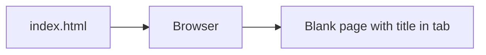

# Architecture -- Stage 0: HTML Skeleton

## Current Structure

```
burger-barn/
  index.html
```

That is the entire project at this stage: a single HTML file.

## Data Flow

There is no data flow yet. The browser reads `index.html`, parses the HTML, and renders a blank page with a title in the tab.



## What Changed

This is the first stage. The project structure is established with one file: `index.html`. Every future stage adds to or modifies files starting from this foundation.
