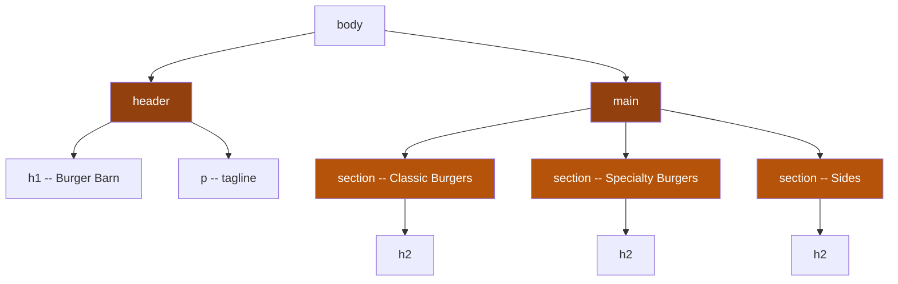

# Architecture -- Stage 2: Semantic Sections

## Current Structure

```
burger-barn/
  index.html       <- the webpage (modified)
```

## Document Outline

The HTML now has a clear hierarchy:



The highlighted nodes are new in this stage. The `<header>` wraps existing content. The `<main>` and three `<section>` elements are entirely new.

## What Changed

The flat body content from Stage 1 is now organized into semantic containers. This is the first time the HTML has a meaningful structure beyond "some elements in a body." Future stages add content inside these sections.
